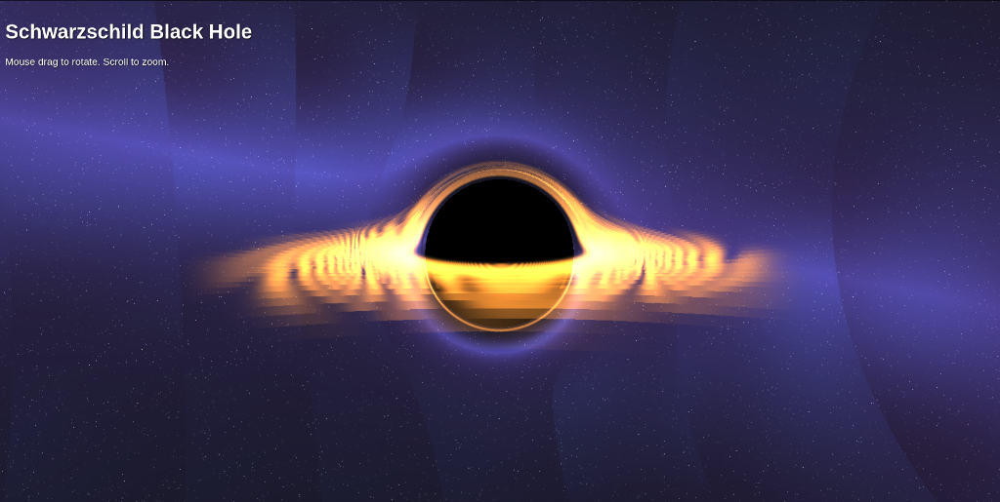

# Real-Time Black Hole Simulation

A WebGL-based visualization of a Schwarzschild black hole, featuring real-time relativistic raymarching, accretion disk rendering, and gravitational lensing effects.

## Features
- **Real-Time Rendering**: Runs at 60 FPS in any modern browser using WebGL.
- **General Relativity**: Simulates light bending (gravitational lensing) around the event horizon.
- **Interactive**: 
  - Drag mouse to orbit the camera.
  - Scroll to zoom in/out.
- **Procedural Graphics**: Star field and accretion disk generated entirely via shaders (no textures required).

## Usage
Simply open `index.html` in your web browser.

## Tech Stack
- HTML5 Canvas
- WebGL / GLSL
- Vanilla JavaScript (No libraries)

## Python Legacy Version
The `physics.py` and `renderer.py` files contain an archived CPU-based ray tracer implementation using NumPy.

---
*Vibe-coded using Antigravity*
